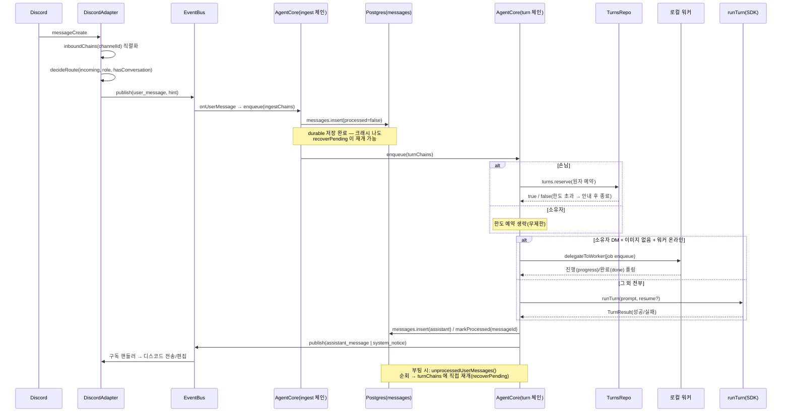

# 메시지 데이터 흐름 (수명주기)

디스코드 메시지 한 통이 도착해서 답장이 나가기까지 거치는 전체 경로를 다룬다. 3-프로세스
토폴로지(봇/워커/DB)의 상위 구조는 `overview.md`를 먼저 참고하고, 이 문서는 그 안의
"봇이 메시지 하나를 어떻게 처리하는가"에 집중한다. 동시성·크래시 복구가 얽히는 가장 까다로운
정합성 지점이므로, 서술한 사실은 모두 코드 원문을 근거로 한다.

## 1단계 — Discord 인입: `messageCreate` → `decideRoute` → `publish`

어댑터(`agent/src/adapters/discord.ts`)는 `client.on("messageCreate", ...)`에서 메시지를
받으면 곧바로 처리하지 않고, `channelId`를 키로 하는 `inboundChains`에 태워 채널별로
직렬화한다. `getRole`/`getByChannelId`가 원격 Postgres 왕복인 비동기 호출이라, 직렬화 없이
매 메시지를 fire-and-forget 하면 같은 채널에 빠르게 도착한 A→B 두 메시지의 조회가 도착
순서와 다르게 끝나 응답·저장 순서가 뒤바뀔 수 있기 때문이다(`discord.ts`의 `inboundChains`
주석).

큐잉된 `onMessage`는 다음을 순서대로 한다.

1. role 조회(`users.getRole`)와 그 채널의 기존 대화 존재 여부(`conversations.getByChannelId`)를 확인한다.
2. 순수 함수 `decideRoute(incoming, role, hasConversation)`을 호출한다. 이 함수는 부수효과가
   전혀 없어 유닛테스트하기 쉽게 분리돼 있으며, 다음 다섯 가지 중 하나로 판정한다.
   - `ignore` — role이 `owner`/`allowed`가 아니면(미등록·blocked) 무조건 무시(응답 게이트).
   - `dm` — DM.
   - `thread-existing` — 이미 `conversations` 행이 있는 스레드/채널(멘션 불필요, 대화 지속).
   - `thread-create` — 일반 채널에서 봇이 직접 `@멘션`됨 → 새 스레드 생성.
   - `adopt-thread` — 아직 대화가 아닌 스레드에서 `@멘션`됨 → 그 스레드를 채택.
3. `ignore`가 아니면 `resolveHint`로 라우팅 결정을 `ConversationHint`(대화 매핑 힌트)로
   바꾼다. `thread-create`만 스레드 생성이라는 부수효과를 가지며, 실패 시(권한 부족 등)
   원 채널을 그대로 대화로 채택하는 인플레이스 폴백을 쓴다.
4. `beginTurn`으로 원본 메시지에 처리중 반응(👀)을 달고, `bus.publish`로
   `user_message` 이벤트(`channel`, `channelRef`, `text`, `ts`, `hint`, `images?`)를
   이벤트버스(`agent/src/events/bus.ts`)에 올린다.

이 시점부터 어댑터는 손을 뗀다 — 실제 처리는 코어가 `user_message`를 구독해서 시작한다.

## 2단계 — 코어의 두 체인: ingest와 turn

`AgentCore`(`agent/src/core/core.ts`)는 `start()`에서 `bus.subscribe("user_message", ...)`로
구독을 건다. 구독 핸들러(`onUserMessage`) 자체는 동기이며 게이트를 다시 한 번 확인한 뒤
**ingest 체인**에 작업을 넣기만 하고 끝난다 — 실제 비동기 작업(그리고 그 오류 처리)은
큐에 들어간 태스크 안에서 일어난다.

코어는 채널(`discordChannelId`)별 직렬 처리를 **ingest 체인**과 **turn 체인**, 두 개의
독립된 `Map<string, Promise<void>>`로 나눠서 관리한다(`ingestChains`, `turnChains`,
`core.ts:77` 부근). 두 체인 모두 같은 `discordChannelId`를 키로 쓰지만 서로 다른 큐이므로,
한쪽이 밀려도 다른 쪽 진행을 막지 않는다.

### ingest 체인 — durable 저장(짧다)

`ingest(hint, ts, text, images)`가 하는 일은 다음과 같다(`core.ts:126`).

1. `resolveConversation`으로 대화 행을 확정한다(멱등: `discord_channel_id` →
   `origin_message_id` → 없으면 생성). 유휴로 닫혔던 대화면 `active`로 재활성한다.
2. 예약어 세션 명령(`/새세션` 등)이면 LLM 턴 없이 세션만 리셋하고 즉시 종료한다.
3. 참가자를 upsert하고, **`processed=false`로 사용자 메시지를 먼저 저장**한다
   (`messages.insert(..., processed: false)`). 저장하는 내용은 이미지가 있어도 원문
   재주입 없이 마커(`buildImageMarker`)만 남긴다.
4. 저장이 끝나면 이 대화의 실제 LLM 처리를 **turn 체인**에 새로 enqueue하고 반환한다.

ingest 자체는 DB insert 한두 번 정도로 짧기 때문에, 채널별로 직렬화해도 버스트가 금방
소진되어 도착한 메시지가 모두 빠르게 durable 저장된다.

### turn 체인 — LLM 턴(길 수 있다)

turn 체인에 들어간 `runConversationTurn(convId, userId, role, text, messageId, images)`이
실제 LLM 처리를 맡는다(아래 3단계). 이 체인도 채널(=대화)별로 직렬화되어 있어 "같은 대화
재진입 금지" 불변식을 유지한다 — 한 대화 안에서 턴 두 개가 동시에 SDK 세션을 건드리는
경합이 나지 않는다.

### 왜 두 체인으로 분리했는가

`core.ts:77` 부근 주석 그대로: 하나의 체인에 ingest와 turn을 함께 묶으면, 앞선 메시지의
긴 LLM 턴이 끝날 때까지 뒤이은 메시지는 **insert조차 되지 못한다**. 그 사이 프로세스가
죽으면 아직 저장되지 않은 메시지는 DB에 `processed=false` 행 자체가 없으므로 부팅 시
`recoverPending`이 복구할 대상이 없어 **영구 유실**된다. ingest와 turn을 분리하면 durable
저장은 LLM 턴의 길이와 무관하게 항상 빠르게 끝나므로, 크래시가 나더라도 "저장은 됐지만
아직 처리는 안 된" 메시지만 남고 그 메시지는 반드시 `recoverPending`이 재개할 수 있다.

## 3단계 — turn 처리: 한도, 위임, 직접 실행

`runConversationTurn`은 대화별 신원(`isOwner = userId === config.ownerId`, role이 아니라
신원으로 판정)에 따라 갈라진다.

- **소유자**: 한도 예약을 생략한다(`turns` 테이블에 기록조차 하지 않음 — 손님 카운트에도
  영향 없음).
- **손님**: `turns.reserve(...)`로 유저별+전역 한도를 **원자적으로** 예약한다
  (`agent/src/store/turnsRepo.ts`). Postgres advisory lock(`pg_advisory_xact_lock`)으로
  전역 직렬 지점을 만들어, 두 요청이 동시에 카운트를 읽고 둘 다 한도 통과로 착각하는 경합을
  막는다. 예약 실패면 한도 안내 메시지만 보내고 턴 자체를 종료한다.

한도 통과 후(또는 소유자라 처음부터 무제한), 다음 조건을 **모두** 만족하면 이 봇이 직접
처리하지 않고 소유자의 로컬 워커에 위임한다(`delegateToWorker`, `core.ts:229`): 이미지
없음, 소유자 신원, DM(사적 대화), 워커 온라인(하트비트 cutoff 30초 이내). 위임 시
`jobs.enqueue`로 `worker_jobs` 큐에 job을 넣고 완료까지 폴링하며 진행상황을 그대로 디스코드로
흘려보낸다 — 이 경로에서는 메시지 저장·세션 갱신을 워커가 이미 끝낸 뒤이므로 코어는 결과를
`publish`만 한다. 네 조건 중 하나라도 어긋나면(서버/스레드 대화, 손님, 워커 오프라인,
이미지 포함 턴 등) 코어가 자신의 SDK 세션으로 `runTurn`을 **직접** 실행하고, 성공하면
`assistant_message`로 응답을, 실패하면 `system_notice`로 오류 안내를 발행한다. 위임/직접
실행 어느 경로든 **turn 처리가 끝나면(성공·실패·예외 모두) `finally`에서
`messages.markProcessed(messageId)`를 호출**해 그 사용자 메시지를 `processed=true`로
닫는다.

## 크래시 복구 불변식

`processed=false`로 먼저 저장 → 부팅 시 `recoverPending`이 재개, 라는 두 지점이 크래시
복구의 전부다.

- **저장 시점**: ingest 체인의 `messages.insert`가 `processed=false`로 행을 만드는 순간이
  "이 메시지는 반드시 처리된다"는 계약의 시작점이다. 이 insert가 끝난 뒤에 프로세스가
  죽어도, 메시지는 DB에 남아 있다.
- **재개 시점**: 부팅 시 `AgentCore.recoverPending()`(`core.ts:379`)이
  `messages.unprocessedUserMessages()`(`processed=false`인 user 메시지 전체, id 오름차순)를
  조회해 각 메시지를 그 대화의 **turn 체인에 직접** enqueue한다(ingest 체인을 다시 거치지
  않는다 — 이미 저장은 끝났으므로). role이 더 이상 `owner`/`allowed`가 아니면(예: 그 사이
  차단됨) 처리 없이 바로 `markProcessed`로 닫는다.

즉 ingest가 끝난 시점부터 turn이 `finally`에서 `markProcessed`를 호출하는 시점까지의
구간에서 프로세스가 죽어도, 그 메시지는 다음 부팅 때 정확히 한 번 더 재개된다(위임된 턴은
`jobs.enqueue`가 `message_id` 유니크 인덱스로 멱등화되어 있어 재개해도 job이 중복 생성되지
않는다).

## 시퀀스 다이어그램

## 관련 문서

- 3-프로세스 토폴로지·위임 규칙 전체: `overview.md`
- 능력 계층·도구 게이팅: `docs/security/capability-model.md`
