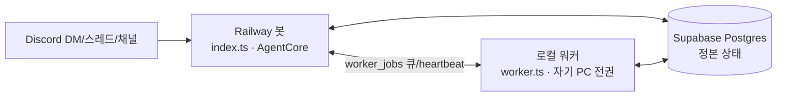

# 아키텍처 개요

Asahi 비서는 **3-프로세스 하이브리드** 구조로 상시 운영된다. 하나의 모놀리식 서버가 아니라,
서로 다른 신뢰 경계에서 도는 두 개의 실행 프로세스(Railway 클라우드 봇 / 로컬 워커)가 하나의
정본 상태 저장소(Supabase Postgres)를 공유하며 협업하는 구조다.

## 세 프로세스

### Railway 클라우드 봇 (`agent/src/index.ts`)

24/7 상시 구동되는 컨테이너다. 디스코드에 연결해 모든 대화(소유자 DM·손님 DM·서버/스레드)를
받아들이는 유일한 진입점이며, `AgentCore`(`agent/src/core/core.ts`)를 구동해 대화별 직렬
처리·세션 관리·한도(rate limit)·위임 판단을 담당한다.

이 컨테이너는 소유자의 PC가 아니므로 파일 시스템·Bash 같은 PC 도구를 신뢰할 수 없다.
`agent/src/config.ts`의 `loadConfig`가 환경변수 `DEPLOY_TARGET`을 읽어 `deployTarget`을
결정하는데, 정확히 `"cloud"`일 때만 `cloud`로 판정하고(그 외 미설정·오타는 모두 `local`)
(`config.ts:53`), `deployTarget === "cloud"`이면 소유자 DM이라도 파일/Bash 계열 PC 도구를
도구셋에서 아예 제외한다(`agent/src/core/agent.ts`의 `allowedToolsFor`/`canUseTool` 이중
방어). 즉 클라우드 봇은 대화·기억·위임 라우팅만 하고, 실제 PC 작업(파일 읽기·쓰기·Bash
실행)은 절대 이 프로세스 안에서 실행되지 않는다.

컨테이너 자체는 무상태(stateless)다 — 재배포되어도 대화·기억·작업 큐는 Supabase Postgres에
남아 있으므로 데이터가 사라지지 않는다.

### 로컬 워커 (`agent/src/worker.ts`)

소유자 PC에서 실행되는 별도 프로세스다. 디스코드에는 전혀 연결하지 않고
(`worker.ts:17-19`), 오직 DB의 `worker_jobs` 큐를 폴링해(`POLL_MS = 2_000`) 자신에게
위임된 job을 집어 실행한다. 이 워커가 실행하는 PC 작업(파일/Bash)은 언제나 워커가 실제로
돌고 있는 **그 PC 위에서** 실행되므로, 소유자 자신의 PC 전권을 그대로 쓸 수 있다 — `allowedDirs`로
등록된 폴더 밖은 `canUseTool`(경로 게이트)이 그대로 막는다는 제약은 클라우드 봇과 동일하게
적용된다. 워커 진입점 내부에서 `runTurn`을 만들 때 `deployTarget`을 항상 `"local"`로
고정한다(`worker.ts:53`) — 워커는 태생적으로 로컬 실행이기 때문이다.

워커는 기동 시 재시작으로 고아가 된 `running` 상태 job을 `failed`로 되돌리고(`worker.ts:61`),
10초 간격으로 `worker_heartbeats`에 생존 신호를 남기며(`HEARTBEAT_MS = 10_000`), job을
잡으면 `agent/src/worker/jobRunner.ts`의 `processJob`으로 실행한 뒤 진행 상황/결과를 job
행에 기록한다.

### Supabase Postgres (정본 상태)

두 프로세스가 공유하는 유일한 정본(source of truth) 저장소다. 연결은 Supabase의
**Session pooler** 연결 문자열(`DATABASE_URL`)을 통해 이뤄지며(`agent/src/store/db.ts`의
`openDb`), 스키마는 `agent/src/store/schema.ts`에 정의된다. 유저·대화·메시지·기억뿐 아니라
위임 큐(`worker_jobs`)와 워커 생존 신호(`worker_heartbeats`)도 이 안에 있다 — 즉 봇과
워커 사이의 "통신"은 별도의 메시지 브로커가 아니라 이 공유 Postgres 테이블을 통해서만
이뤄진다.

## 조율: 위임 큐와 하트비트

봇과 워커는 서로를 직접 호출하지 않는다. 대신 Postgres 테이블 두 개로 느슨하게 결합된다.

- **`worker_jobs`** (`schema.ts:152`) — 봇이 로컬 워커에게 넘길 턴을 적재하는 큐. 컬럼은
  `status`(`pending → running → done/failed`), `progress`, `result`, `error`,
  `claimed_ts`, `done_ts`, `delivered_ts` 등으로 구성된다. `message_id`에 부분 유니크
  인덱스를 걸어(`idx_worker_jobs_message_id`) 같은 사용자 메시지로 위임이 중복 생성되지
  않도록 멱등화한다 — 봇이 크래시 후 `recoverPending`으로 같은 메시지를 재처리해도 기존
  job에 합류할 뿐 중복 실행되지 않는다.
- **`worker_heartbeats`** (`schema.ts:183`) — 사용자별 워커 생존 신호. 워커가 10초마다
  갱신하고, 봇은 `JobsRepo.isOnline`으로 "이 사용자의 워커가 지금 떠 있는지"를 판단한다.
- **`isOnline` cutoff** — `AgentCore`는 하트비트가 `WORKER_ONLINE_CUTOFF_MS = 30_000`
  (30초, `core.ts:22`)보다 오래됐으면 오프라인으로 간주한다. 이 값은 워커의
  `HEARTBEAT_MS`(10초)의 3배로, 한두 번 하트비트가 늦어도 잘못 오프라인 판정하지 않도록
  여유를 둔 것이다.

봇이 job을 enqueue한 뒤에는 `WORKER_POLL_MS`(500ms) 간격으로 최대 `WORKER_TIMEOUT_MS`
(120초) 동안 그 job의 진행/완료를 폴링하며 디스코드로 진행 상황과 최종 결과를 흘려보낸다
(`AgentCore.delegateToWorker`). 타임아웃 안에 끝나지 않으면 "아직 처리 중"이라 안내하고,
job은 `delivered_ts` 없이 남겨둔다 — 이후 워커가 뒤늦게 끝내면 봇이 1분마다 도는 배달 스윕
(`deliverPendingJobResults`, `index.ts`의 유휴 정리 타이머 옆)이 그 결과를 대신 배달해
유실을 막는다.

## 위임 규칙

`AgentCore.runConversationTurn`(`core.ts`)은 매 턴마다 이 봇이 직접 처리할지, 소유자의
로컬 워커에 위임할지를 판단한다. 위임은 다음 조건을 **모두** 만족할 때만 이뤄진다
(`core.ts:229`):

1. **이미지가 없음** (`images.length === 0`) — 워커 경로는 아직 멀티모달을 다루지 않으므로,
   이미지가 있는 턴은 항상 이 봇이 직접 처리해 모델이 이미지를 보게 한다.
2. **소유자 신원** (`isOwner`, `userId === config.ownerId`) — `role`이 아니라 신원으로
   판정한다. 위임은 소유자 전용 정책이다: 손님이 자기 워커를 돌리려면 공유
   `DATABASE_URL`이 필요한데, `WORKER_USER_ID`를 소유자 ID로 설정해 소유자를 사칭하면
   전권을 탈취할 수 있기 때문이다. `WORKER_SECRET` 검증·행 단위 권한 분리(RLS) 같은 인증
   인프라가 갖춰지기 전까지는 손님 DM은 워커가 온라인이어도 항상 이 봇이(cloud 도구셋으로)
   처리한다 — 이것이 보안상 손님 DM을 항상 봇이 처리하는 이유다.
3. **DM(사적 대화)** (`conv.isPrivate`) — 서버/스레드 대화는 특정 개인 소유가 아니므로
   위임 대상이 모호해 항상 이 봇이 처리한다.
4. **워커 온라인** (`this.repos.jobs.isOnline(userId, WORKER_ONLINE_CUTOFF_MS)`) — 위
   30초 cutoff 판정을 통과해야 한다.

네 조건을 모두 만족하면 `delegateToWorker`로 job을 넣고 결과를 폴링하며, 하나라도
어긋나면 봇이 자신의 SDK 세션으로 턴을 직접 실행한다(소유자 DM인데 워커가 오프라인이면
클라우드 도구셋으로, 손님/서버는 애초에 위임 후보가 아니다).

## 이벤트버스로 어댑터 분리

`agent/src/events/bus.ts`의 `EventBus`는 디스코드 등 채널 어댑터와 `AgentCore`를
분리하는 얇은 pub/sub 계층이다. 어댑터(`agent/src/adapters/discord.ts`)는 디스코드
메시지를 받으면 `UserMessageEvent`(대화 매핑 힌트 `ConversationHint` 포함)를
`publish`하고, `AgentCore.start()`는 `"user_message"`를 `subscribe`해 처리를 시작한다.
반대로 코어가 만든 응답은 `AssistantMessageEvent`/`SystemNoticeEvent`/`ProgressEvent`로
`publish`되고, 어댑터가 이를 구독해 실제 디스코드 전송(또는 편집)을 수행한다. 이 구조
덕분에 코어는 디스코드 API를 전혀 몰라도 되고, 향후 다른 채널(웹 UI 등)을 추가할 때도
코어를 건드리지 않고 새 어댑터만 붙이면 된다.

## 다이어그램

## 관련 문서

- 능력 계층·도구 게이팅: `docs/security/capability-model.md`
- 위협 모델·알려진 한계: `SECURITY.md`, `docs/security/risk-register.md`
- 현재 라이브 상태·미완 항목: `docs/status/STATUS.md`
- 배포 절차: `deploy/railway-셋업.md`, `deploy/worker-셋업.md`, `deploy/다른-PC-셋업.md`
- 데이터 흐름 상세(메시지 → 저장 → 응답 경로): `docs/architecture/data-flow.md`
