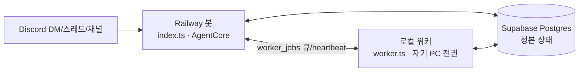

# 문서 체계 구축 · 최신화 Implementation Plan

> **For agentic workers:** REQUIRED SUB-SKILL: Use superpowers:subagent-driven-development (recommended) or superpowers:executing-plans to implement this plan task-by-task. Steps use checkbox (`- [ ]`) syntax for tracking.

**Goal:** 감사에서 드러난 문서 드리프트와 부재를 해소해, 리포만으로 Asahi를 이해·셋업·운영·기여할 수 있는 정본 문서 체계를 구축한다.

**Architecture:** 살아있는 문서(README·deploy·architecture·security·status)는 현실을 반영하도록 수정/신규 작성하고, 역사 문서(specs/plans/notes)는 `docs/design-archive/`로 이동해 상태 스탬프로 보존한다. 프로젝트 상태·보안모델을 Claude 외부 메모리에서 리포로 승격(새니타이즈)하고, ADR·CHANGELOG·worker 배선·docs CI로 재드리프트를 막는다.

**Tech Stack:** Markdown(+GitHub mermaid), YAML front-matter, Node.js 스크립트(검증), GitHub Actions, PM2(ecosystem.config.cjs), git.

**설계 스펙:** [docs/superpowers/specs/2026-07-13-documentation-system-design.md](../specs/2026-07-13-documentation-system-design.md)

## Global Constraints

- **언어:** 모든 새 문서는 **한국어**(결정 D1).
- **브랜치:** 전 작업을 `docs/documentation-system`에서 수행(이미 생성됨, 스펙 커밋 `5cb32f9`). `main` 직접 수정 금지.
- **커밋 규약:** 제목 `docs:`(문서) / `chore:`(정리) / `ci:`(워크플로) / `feat:`(worker 배선) 접두. 한국어. 각 커밋 말미에 `Co-Authored-By: Claude Opus 4.8 <noreply@anthropic.com>`.
- **비밀·데이터 금지:** 커밋에 Discord owner ID·앱 ID·토큰·`DATABASE_URL`·`data/` 를 절대 포함하지 않는다. 승격 문서는 반드시 새니타이즈(결정 D3).
- **살아있는 문서 금칙어:** README·`deploy/*`·`.env.example`에 `better-sqlite3`·`agent.db`가 **현재 저장소로** 등장하면 안 된다(회귀 가드 Task 21).
- **front-matter 규약:** 관리 대상 문서 상단 YAML — 역사 문서는 `status`(Draft|Approved|Shipped|Superseded)+`shippedIn`, 살아있는 문서는 `lastReviewed`(YYYY-MM-DD). 스펙 §5 참조.
- **문서 작업 사이클:** 프로즈 문서는 유닛 테스트가 없으므로 **작성 → 검증 명령(grep/링크/섹션 존재/`test -f`) → 커밋**. 코드/설정은 실제 코드 전부 명시.
- **작업 디렉토리:** 리포 루트 `E:/Asahi`. npm 명령은 `agent/`에서.

---

## 파일 구조 (생성/수정 맵)

**생성(살아있는 문서):** `CONTRIBUTING.md`, `SECURITY.md`, `CHANGELOG.md`, `docs/README.md`, `docs/architecture/{overview,data-flow,module-boundaries,glossary}.md`, `docs/security/{capability-model,risk-register}.md`, `docs/status/{STATUS,ROADMAP}.md`, `docs/decisions/{README,0001..0005,review-ledger}.md`, `deploy/{worker-셋업,incident-runbook,smoke-test}.md`
**생성(자동화):** `.github/workflows/docs.yml`, `scripts/check-docs.mjs`
**수정:** `README.md`, `.env.example`, `.gitignore`, `deploy/다른-PC-셋업.md`, `deploy/PM2-명령어.md`, `agent/package.json`, `deploy/ecosystem.config.cjs`
**이동(git mv):** `docs/superpowers/{specs,plans,notes}` → `docs/design-archive/{specs,plans,notes}` + 각 파일 front-matter 추가 + `docs/design-archive/README.md`
**삭제:** `agent/윈도우자동실행.txt`(내용 흡수 후), 디스크의 `data/store/agent.db*`(gitignore 잔재)
**리포 외 수정:** `C:/Users/user/.claude/projects/E--Asahi/memory/{MEMORY.md,project-status.md}` 포인터화

> **참고:** 이 계획(`2026-07-13-documentation-system.md`)과 스펙(`2026-07-13-documentation-system-design.md`)은 아직 진행중이므로 Task 7의 아카이브 이동에서 **제외**한다(완료된 13건만 이동).

---

## Phase 1 — 출혈 정지 (살아있는 문서 드리프트 수정)

### Task 1: `.gitignore` 보강 + 낡은 SQLite 잔재 삭제

**Files:**
- Modify: `.gitignore`
- Delete(디스크): `data/store/agent.db`, `data/store/agent.db-wal`, `data/store/agent.db-shm`

- [ ] **Step 1: `.gitignore`에 `*.txt` 추가**

`.gitignore` 의 `# 로그` 섹션에 이어 붙인다:

```gitignore
# 로그
*.log

# 런타임 stdout 스냅샷·임시 메모(server.txt, localworker.txt 등) — 실수 커밋 방지
*.txt
```

- [ ] **Step 2: 낡은 SQLite 파일 삭제(Postgres 이전 후 잔재, gitignore된 data/ 내부)**

Run:
```bash
rm -f data/store/agent.db data/store/agent.db-wal data/store/agent.db-shm
```

- [ ] **Step 3: 검증 — 잔재 없음 + txt 무시 확인**

Run:
```bash
ls data/store/ 2>/dev/null | grep -c 'agent.db' ; git check-ignore -q server.txt && echo "txt-ignored"
```
Expected: `0` 그리고 `txt-ignored`

- [ ] **Step 4: 커밋**

```bash
git add .gitignore
git commit -m "chore: .gitignore에 *.txt 추가 + 낡은 SQLite 잔재 정리

Co-Authored-By: Claude Opus 4.8 <noreply@anthropic.com>"
```

---

### Task 2: `README.md` 재작성 (Postgres/Railway/워커 현실 반영)

**Files:**
- Modify: `README.md`

**Reference(현실 확인 근거):** store=Postgres(`agent/src/store/db.ts`, `agent/package.json`의 `pg`), Railway 배포(`deploy/railway-셋업.md`), 워커(`agent/src/worker.ts`), 소스 목록(`agent/src/`).

- [ ] **Step 1: README 본문 재작성**

다음을 반드시 반영해 재작성한다(기존 톤·구조 유지, 한국어):
- 소개: "기억(SQLite + 마크다운)" → "기억(Supabase Postgres + 마크다운)". PC 재부팅/세션 교체에도 이어짐은 유지.
- 폴더 구조 블록: `data/store` 설명의 "SQLite DB (agent.db)" → "런타임 DB는 Supabase Postgres(원격, DATABASE_URL). `data/`는 로컬 캐시/기억 마크다운". `agent/src/` 나열에 `worker`(로컬 워커) 포함.
- **신규 "구성(배포) 개요" 섹션**: 3-프로세스 하이브리드 한 단락 — Railway 클라우드 봇(상시) + 로컬 워커(소유자 PC 작업 위임) + Supabase Postgres(정본 상태). 각각 `deploy/railway-셋업.md`, `deploy/worker-셋업.md`, `docs/architecture/overview.md` 링크.
- 개발 섹션: `npm install / npm test / npm run dev` 유지, `.env` 는 리포 루트, `DATABASE_URL`(Session pooler) 필수 명시.
- 상시 구동: "로컬 PM2" 대신 "24/7은 Railway(`deploy/railway-셋업.md`), 로컬 PM2는 폴백(`deploy/PM2-명령어.md`)".
- `현재 단계` 문장: 값을 박지 말고 `docs/status/STATUS.md` 링크로 대체.
- 문서 안내: `docs/README.md`(문서 인덱스), `CONTRIBUTING.md`, `SECURITY.md` 링크.
- front-matter 추가: `lastReviewed: 2026-07-13`.

- [ ] **Step 2: 검증 — 금칙어 없음 + 필수 링크 존재**

Run:
```bash
grep -niE 'better-sqlite3|agent\.db' README.md ; echo "exit=$?"
grep -c 'docs/status/STATUS.md\|deploy/railway-셋업.md' README.md
```
Expected: 첫 grep 결과 없음(`exit=1`), 둘째 `>=2`

- [ ] **Step 3: 커밋**

```bash
git add README.md
git commit -m "docs: README를 Postgres/Railway/워커 현실로 재작성

Co-Authored-By: Claude Opus 4.8 <noreply@anthropic.com>"
```

---

### Task 3: `deploy/다른-PC-셋업.md` 수정 (Postgres 중앙화 현실)

**Files:**
- Modify: `deploy/다른-PC-셋업.md`

- [ ] **Step 1: 본문 수정**

- §사전 요구: `better-sqlite3` 네이티브 빌드 단락 **삭제**. 대신 "**`DATABASE_URL`(Supabase Session pooler) 필수** — 같은 DB를 가리켜야 기억이 이어진다" 추가.
- §.env 준비: `DATABASE_URL` 항목을 필수 목록에 추가(`deploy/railway-셋업.md`의 DATABASE_URL 섹션 링크).
- §"⚠️ 반드시 지킬 것" 2번: "기억(data/)은 각 PC 로컬 — 자동으로 이어지지 않음" → "**기억은 Supabase Postgres 중앙에 있어 어느 PC에서 띄워도 이어진다.** `data/`의 마크다운 메모리만 로컬"으로 재작성.
- §데이터 이전: SQLite `agent.db`/WAL 복사 안내 **삭제**. "Postgres라 DB 이전 불필요. 마크다운 기억(`data/memory`)만 옮기면 됨"으로 축약.
- 말미 인용구: "상시 자동 동기화는 별도 설계 필요" → "런타임 상태는 Supabase로 이미 공유됨. 로컬 마크다운 기억만 수동 이전"으로 반전.
- §3 `allow_dir`(경로가 PC별)은 사실이므로 유지.
- "봇은 한 번에 한 PC" 제약 유지, Railway와도 동시 금지임을 한 줄 추가.
- front-matter 추가: `lastReviewed: 2026-07-13`.

- [ ] **Step 2: 검증**

Run:
```bash
grep -niE 'better-sqlite3|agent\.db' "deploy/다른-PC-셋업.md" ; echo "exit=$?"
grep -c 'DATABASE_URL' "deploy/다른-PC-셋업.md"
```
Expected: 첫 grep 없음(`exit=1`), 둘째 `>=1`

- [ ] **Step 3: 커밋**

```bash
git add "deploy/다른-PC-셋업.md"
git commit -m "docs: 다른-PC-셋업을 Postgres 중앙화 현실로 수정

Co-Authored-By: Claude Opus 4.8 <noreply@anthropic.com>"
```

---

### Task 4: `deploy/PM2-명령어.md` 폴백 배너 + `윈도우자동실행.txt` 흡수

**Files:**
- Modify: `deploy/PM2-명령어.md`
- Delete: `agent/윈도우자동실행.txt`

- [ ] **Step 1: PM2 문서 상단에 배너 추가**

문서 최상단에 삽입:

```markdown
> **⚠️ 이 흐름은 로컬/폴백용입니다.** 24/7 상시 구동은 이제 Railway(클라우드)입니다 — `deploy/railway-셋업.md` 참고. 디스코드 봇 토큰은 하나뿐이므로, **로컬 PM2로 띄우려면 Railway 배포를 먼저 정지**해야 합니다(동시 실행 시 게이트웨이 세션 충돌).
```

- [ ] **Step 2: `윈도우자동실행.txt` 내용을 "부팅 자동시작" 섹션으로 흡수**

`agent/윈도우자동실행.txt`의 명령(`pm2 save`, `pm2-windows-startup`, `powercfg` 절전방지)을 PM2 문서에 "## 부팅 자동시작 + 절전 방지(로컬 전용)" 섹션으로 편입. 이미 동일 내용이 있으면 중복 없이 정리.

- [ ] **Step 3: 원본 txt 삭제**

Run:
```bash
git rm --cached "agent/윈도우자동실행.txt" 2>/dev/null; rm -f "agent/윈도우자동실행.txt"
```
(미추적이었으면 `git rm --cached`는 무시되고 `rm`만 적용된다.)

- [ ] **Step 4: 검증**

Run:
```bash
test ! -f "agent/윈도우자동실행.txt" && echo "removed"
grep -c 'railway-셋업.md\|부팅 자동시작' "deploy/PM2-명령어.md"
```
Expected: `removed`, 그리고 `>=2`

- [ ] **Step 5: 커밋**

```bash
git add "deploy/PM2-명령어.md"
git commit -m "docs: PM2 문서에 Railway 폴백 배너 + 윈도우자동실행 흡수

Co-Authored-By: Claude Opus 4.8 <noreply@anthropic.com>"
```

---

### Task 5: `.env.example`에 `ANTHROPIC_MODEL` 추가

**Files:**
- Modify: `.env.example`

- [ ] **Step 1: 항목 추가**

`DEPLOY_TARGET` 항목 아래에 삽입:

```bash
# (선택) 사용할 Claude 모델, 기본 claude-opus-4-8 (config.ts)
ANTHROPIC_MODEL=
```

`CLAUDE_CODE_OAUTH_TOKEN` 주석에 "cloud(DEPLOY_TARGET=cloud)에선 사실상 필수 — 없으면 SDK 인증 실패" 한 줄 보강.

- [ ] **Step 2: 검증**

Run:
```bash
grep -c 'ANTHROPIC_MODEL' .env.example
```
Expected: `1`

- [ ] **Step 3: 커밋**

```bash
git add .env.example
git commit -m "docs: .env.example에 ANTHROPIC_MODEL 추가

Co-Authored-By: Claude Opus 4.8 <noreply@anthropic.com>"
```

---

## Phase 2 — 스캐폴딩 + 역사 문서 아카이브

### Task 6: `docs/` 폴더 스캐폴드 + 인덱스 스텁

**Files:**
- Create: `docs/README.md`, `docs/architecture/.gitkeep`, `docs/security/.gitkeep`, `docs/status/.gitkeep`, `docs/decisions/.gitkeep`

- [ ] **Step 1: 폴더 + 인덱스 스텁 작성**

`docs/README.md`(문서 인덱스, 이후 Task 22에서 완성)에 front-matter(`lastReviewed: 2026-07-13`)와 섹션 골격만 둔다:
```markdown
# Asahi 문서 인덱스
- 아키텍처: architecture/
- 보안: security/
- 상태·로드맵: status/
- 결정 기록(ADR): decisions/
- 설계 아카이브(역사): design-archive/
- 운영(런북): ../deploy/
```
빈 폴더 추적을 위해 각 폴더에 `.gitkeep` 생성.

- [ ] **Step 2: 검증**

Run:
```bash
for d in architecture security status decisions; do test -d "docs/$d" && echo "docs/$d ok"; done
test -f docs/README.md && echo "index ok"
```
Expected: 5줄 모두 `ok`

- [ ] **Step 3: 커밋**

```bash
git add docs/README.md docs/architecture docs/security docs/status docs/decisions
git commit -m "docs: 문서 taxonomy 폴더 스캐폴드 + 인덱스 스텁

Co-Authored-By: Claude Opus 4.8 <noreply@anthropic.com>"
```

---

### Task 7: 역사 문서 → `docs/design-archive/` 이동 + 상태 스탬프 + 인덱스

**Files:**
- Move(git mv): `docs/superpowers/{specs,plans,notes}` 하위 **완료 13건** → `docs/design-archive/{specs,plans,notes}`
- Modify: 이동된 13개 파일(front-matter + 폐기 배너)
- Create: `docs/design-archive/README.md`

> **이동 제외:** `docs/superpowers/specs/2026-07-13-documentation-system-design.md` 와 `docs/superpowers/plans/2026-07-13-documentation-system.md`(진행중). `docs/superpowers/`는 진행중 SDD 작업공간으로 남긴다.

- [ ] **Step 1: 이동(이력 보존)**

Run:
```bash
mkdir -p docs/design-archive/specs docs/design-archive/plans docs/design-archive/notes
git mv docs/superpowers/specs/2026-07-11-pc-ai-assistant-design.md docs/design-archive/specs/
git mv docs/superpowers/specs/2026-07-11-multiuser-selfaware-db-design.md docs/design-archive/specs/
git mv docs/superpowers/specs/2026-07-12-asahi-persona-character-design.md docs/design-archive/specs/
git mv docs/superpowers/specs/2026-07-12-discord-image-input-design.md docs/design-archive/specs/
git mv docs/superpowers/specs/2026-07-12-self-awareness-db-introspection-design.md docs/design-archive/specs/
git mv docs/superpowers/plans/2026-07-11-phase1-core-discord.md docs/design-archive/plans/
git mv docs/superpowers/plans/2026-07-11-phase2a-data-foundation.md docs/design-archive/plans/
git mv docs/superpowers/plans/2026-07-11-phase2b-multiuser-runtime.md docs/design-archive/plans/
git mv docs/superpowers/plans/2026-07-12-asahi-persona-character.md docs/design-archive/plans/
git mv docs/superpowers/plans/2026-07-12-discord-image-input.md docs/design-archive/plans/
git mv docs/superpowers/plans/2026-07-12-self-awareness-db-introspection.md docs/design-archive/plans/
git mv docs/superpowers/notes/2b-api-spike.md docs/design-archive/notes/
```

- [ ] **Step 2: 각 파일에 front-matter 상태 스탬프 추가**

이동한 13개 파일 각각의 최상단에 YAML front-matter를 추가한다. `status: Shipped`, `shippedIn`은 아래 매핑의 커밋. 이미 `#` 제목으로 시작하면 front-matter를 그 위에 삽입.

| 파일 | shippedIn | 비고 |
|---|---|---|
| specs/2026-07-11-pc-ai-assistant-design.md | (phase1 초기) | **Superseded** 배너 대상 |
| specs/2026-07-11-multiuser-selfaware-db-design.md | 2A/2B 병합 | 부분 Superseded(저장소·토폴로지) |
| specs/2026-07-12-asahi-persona-character-design.md | 15907fb | Shipped |
| specs/2026-07-12-discord-image-input-design.md | 7215725 | Shipped |
| specs/2026-07-12-self-awareness-db-introspection-design.md | 039f91a | Shipped |
| plans/2026-07-11-phase1-core-discord.md | phase1 | **Superseded** 배너 대상 |
| plans/2026-07-11-phase2a-data-foundation.md | 2A | **Superseded**(Postgres 이전) 배너 대상 |
| plans/2026-07-11-phase2b-multiuser-runtime.md | 2B | Shipped |
| plans/2026-07-12-asahi-persona-character.md | 15907fb | Shipped |
| plans/2026-07-12-discord-image-input.md | 7215725 | Shipped |
| plans/2026-07-12-self-awareness-db-introspection.md | 039f91a | Shipped |
| notes/2b-api-spike.md | 2B | Shipped |

front-matter 형식:
```yaml
---
title: <기존 제목>
status: Shipped        # 또는 Superseded
shippedIn: <commit>
supersededBy: <해당 시 ADR/코드 경로, 없으면 생략>
---
```

- [ ] **Step 3: SQLite/PM2 시대 문서에 폐기 배너(상단 한 줄)**

`pc-ai-assistant-design.md`, `phase1-core-discord.md`, `phase2a-data-foundation.md` front-matter 아래에 삽입(본문 미수정):
```markdown
> **⚠️ SUPERSEDED (점-시점 기록):** 저장소는 이후 Postgres로 이전(ADR 0001), 배포는 Railway+로컬 워커 하이브리드(ADR 0002)로 바뀌었습니다. 현재 구조는 `docs/architecture/overview.md`, 현재 상태는 `docs/status/STATUS.md`를 보세요. 이 문서는 당시 설계를 그대로 보존합니다.
```

- [ ] **Step 4: `docs/design-archive/README.md` 인덱스 작성**

front-matter(`lastReviewed: 2026-07-13`) + 표: 각 문서 → status → shippedIn → 대응 현재문서/ADR. "미체크 태스크 박스는 당시 계획의 흔적이며 재실행 대상이 아님"을 명시.

- [ ] **Step 5: 검증 — 모든 아카이브 문서가 front-matter status 보유 + superpowers 비움**

Run:
```bash
node -e '
const fs=require("fs"),p=require("path");
const dir="docs/design-archive";
let bad=[];
for(const sub of ["specs","plans","notes"]) for(const f of fs.readdirSync(p.join(dir,sub))){
  const t=fs.readFileSync(p.join(dir,sub,f),"utf8");
  if(!/^---[\s\S]*?\bstatus:\s*(Shipped|Superseded)/m.test(t.slice(0,400))) bad.push(sub+"/"+f);
}
console.log(bad.length? "MISSING status: "+bad.join(", ") : "all-stamped");
'
ls docs/superpowers/specs docs/superpowers/plans | grep -v 2026-07-13 | grep -c . 
```
Expected: `all-stamped`, 그리고 둘째 명령 `0`(진행중 2건 외 잔여 없음)

- [ ] **Step 6: 커밋**

```bash
git add docs/design-archive docs/superpowers
git commit -m "docs: 완료 스펙/계획 13건을 design-archive로 이동 + 상태 스탬프

Co-Authored-By: Claude Opus 4.8 <noreply@anthropic.com>"
```

---

## Phase 3 — 외부 메모리 → 리포 승격 (새니타이즈)

### Task 8: `docs/status/STATUS.md` + `ROADMAP.md`

**Files:**
- Create: `docs/status/STATUS.md`, `docs/status/ROADMAP.md`
- Source: `C:/Users/user/.claude/projects/E--Asahi/memory/project-status.md`(읽기 전용 참조)

- [ ] **Step 1: 외부 메모리 읽기**

Run:
```bash
cat "C:/Users/user/.claude/projects/E--Asahi/memory/project-status.md" | head -5
```
(내용 참조용. 아래 새니타이즈 규칙으로 리포용으로 재작성.)

- [ ] **Step 2: `STATUS.md` 작성(새니타이즈)**

front-matter(`lastReviewed: 2026-07-13`) + 섹션:
- **현재 상태**: 라이브(Railway)·로컬 워커·Supabase, 병합된 기능 목록(멀티유저·원격개발·페르소나·자기인지 DB·이미지 입력·opus-4-8), 테스트 319 pass+1 skip.
- **미완/미검증**: 실 Supabase 스모크 항목(READ ONLY 쓰기거부·워커 실통신·이미지 인식·`/새세션` 톤) → `deploy/smoke-test.md` 링크.
- **알려진 한계**: 하드 크래시 중 전송 1건 유실 가능 등.

**새니타이즈(필수):** Discord owner ID, 앱 ID(`1525474…`), `.env`/`DATABASE_URL` 실제 값·경로, 개인 식별정보를 **제거/일반화**. 커밋 전 Step 4 grep 게이트.

- [ ] **Step 3: `ROADMAP.md` 작성**

인격체화 3축(캐릭터·자기인지·능동성) 남은 축, 2C(관측: actions/turns 로깅)→2D(백업)→2E(능동성)→후속(웹UI). 5단계 로드맵 요약.

- [ ] **Step 4: 검증 — 민감정보 누출 없음**

Run:
```bash
grep -nE '1525474|[0-9]{17,19}|postgresql://|@aws-[0-9]' docs/status/STATUS.md docs/status/ROADMAP.md ; echo "exit=$?"
```
Expected: 없음(`exit=1`). 만약 검출되면 새니타이즈 후 재검.

- [ ] **Step 5: 커밋**

```bash
git add docs/status/STATUS.md docs/status/ROADMAP.md
git commit -m "docs: 프로젝트 상태·로드맵을 리포로 승격(새니타이즈)

Co-Authored-By: Claude Opus 4.8 <noreply@anthropic.com>"
```

---

### Task 9: `docs/security/capability-model.md` + `risk-register.md` + 루트 `SECURITY.md`

**Files:**
- Create: `docs/security/capability-model.md`, `docs/security/risk-register.md`, `SECURITY.md`
- Source: `C:/Users/user/.claude/projects/E--Asahi/memory/security-capability-model.md`; 코드 `agent/src/core/{tools.ts,pathPermission.ts,agent.ts,sqlGuard.ts}`

- [ ] **Step 1: `capability-model.md` 작성**

front-matter + 내용:
- **능력 계층표**(`allowedToolsFor`, tools.ts:144): owner-DM-local(파일+Bash+기억+접근관리+허용폴더+DB조회) / owner-DM-cloud(PC도구 제외) / ownWorkstation(손님 자기 PC 전권) / 손님 DM(기억 본인) / 서버(recall 공용).
- **신원 vs 역할 게이팅**: 특권은 `isOwner`(userId===ownerId), 역할(`role`) 아님(core.ts, tools.ts `isOwnerDm`/`canManagePc`).
- **경로 게이팅**: `canUseTool`→`decidePathPermission`(pathPermission.ts), realpath 정규화, glob 리터럴 접두, cloud 이중방어, `dangerouslyDisableSandbox` 차단(agent.ts).
- **READ ONLY SQL 가드**: `assertReadOnlySql`(sqlGuard.ts) + Postgres READ ONLY 트랜잭션(introspectRepo.ts).
- **보안-핵심 파일 목록**과 지켜야 할 불변식·가드 테스트(`agent/tests/{pathPermission,sqlGuard,tools}.test.ts`).

- [ ] **Step 2: `risk-register.md` 작성(완화 서술, D3)**

알려진 한계를 **일반화해** 서술:
- "`DATABASE_URL`은 소유자 전용 비밀. 유출 시 위임 신뢰경계가 무너진다. 손님용 워커는 `WORKER_SECRET` 검증·RLS 미구현으로 아직 미지원." — **정확한 사칭 절차·페이로드는 싣지 않는다.**
- 하드 크래시 중 전송 유실, pg-mem이 검증 못 하는 보장(실 Supabase 스모크 필요) 참조.

- [ ] **Step 3: 루트 `SECURITY.md` 작성(공개용 요약)**

GitHub 표준 위치. 위협모델 요약(자산·행위자: 손님/관찰콘텐츠·이미지 경유 인젝션/클라우드 컨테이너/유출된 연결문자열 → 완화책), 취약점 보고 창구 한 줄, 상세는 `docs/security/`로 링크. 완화 서술 유지.

- [ ] **Step 4: 검증 — 민감정보 없음 + 파일 존재**

Run:
```bash
grep -nE '1525474|[0-9]{17,19}|postgresql://' SECURITY.md docs/security/*.md ; echo "exit=$?"
for f in SECURITY.md docs/security/capability-model.md docs/security/risk-register.md; do test -f "$f" && echo "$f ok"; done
```
Expected: grep 없음(`exit=1`), 3줄 `ok`

- [ ] **Step 5: 커밋**

```bash
git add SECURITY.md docs/security/capability-model.md docs/security/risk-register.md
git commit -m "docs: 보안 능력모델·위험등록부·SECURITY.md 승격(완화 서술)

Co-Authored-By: Claude Opus 4.8 <noreply@anthropic.com>"
```

---

### Task 10: 외부 메모리 포인터화 (이중 관리 제거)

**Files:**
- Modify(리포 외): `C:/Users/user/.claude/projects/E--Asahi/memory/MEMORY.md`, `.../project-status.md`

- [ ] **Step 1: `project-status.md`를 포인터로 축소**

`project-status.md` 본문 상단에 명시: "**정본은 이제 리포의 `docs/status/STATUS.md`·`docs/status/ROADMAP.md`.** 이 메모리는 요약 포인터만 유지한다." 상세 진행 이력은 그대로 두되(개인 참조용), "정본 아님" 표식.

- [ ] **Step 2: `MEMORY.md` 인덱스 줄 갱신**

`project-status.md` 항목 설명을 "정본은 리포 docs/status — 이 메모리는 포인터"로 갱신. `security-capability-model.md` 항목도 "정본은 리포 docs/security"로.

- [ ] **Step 3: 검증**

Run:
```bash
grep -c 'docs/status\|정본' "C:/Users/user/.claude/projects/E--Asahi/memory/project-status.md"
```
Expected: `>=1`

- [ ] **Step 4: 커밋 없음(리포 외 파일)** — 이 태스크는 커밋 대상이 아니다. 완료만 기록.

---

## Phase 4 — 신규 살아있는 문서

### Task 11: `docs/architecture/overview.md` (토폴로지 + 다이어그램)

**Files:**
- Create: `docs/architecture/overview.md`

- [ ] **Step 1: 작성 (필수 반영 사실)**

front-matter(`lastReviewed: 2026-07-13`) + 내용:
- 3-프로세스 하이브리드: **Railway 봇**(`DEPLOY_TARGET=cloud`, config.ts:53; PC 도구 비활성), **로컬 워커**(`agent/src/worker.ts`; 자기 PC 전권), **Supabase Postgres**(정본 상태, Session pooler).
- 조율: `worker_jobs` 위임 큐(schema.ts:152) + `worker_heartbeats`(schema.ts:183) + `isOnline` cutoff 30초(core.ts:22, `WORKER_ONLINE_CUTOFF_MS`).
- 위임 규칙: 소유자 DM + 워커 온라인 + 이미지 없음일 때만 위임(core.ts `runConversationTurn`), 손님 DM은 항상 봇 처리(보안).
- 이벤트버스(`agent/src/events/bus.ts`)로 어댑터↔코어 분리.
- **mermaid 다이어그램**(GitHub 렌더):


- [ ] **Step 2: 검증**

Run:
```bash
grep -c 'mermaid\|worker_jobs\|Supabase' docs/architecture/overview.md
```
Expected: `>=3`

- [ ] **Step 3: 커밋**

```bash
git add docs/architecture/overview.md
git commit -m "docs: 아키텍처 개요 + 3-프로세스 토폴로지 다이어그램

Co-Authored-By: Claude Opus 4.8 <noreply@anthropic.com>"
```

---

### Task 12: `docs/architecture/data-flow.md`

**Files:**
- Create: `docs/architecture/data-flow.md`

- [ ] **Step 1: 작성 (필수 반영 사실)**

front-matter + 메시지 수명주기 시퀀스:
- Discord `messageCreate` → `decideRoute`(discord.ts, 순수함수) → `bus.publish(user_message)`.
- 코어: **ingest 체인**(채널별 직렬, durable insert `processed=false`, core.ts:126) → **turn 체인**(채널별 직렬, core.ts).
- turn: 소유자=한도 없음 / 손님=`turns.reserve` 원자예약 → 위임(`delegateToWorker`) 또는 직접 `runTurn` → 응답 이벤트.
- **크래시복구 불변식**: `processed=false`로 먼저 저장 → 부팅 `recoverPending` 재개(core.ts:379).
- ingest/turn 두 체인 분리 이유(긴 LLM 턴이 durable 저장을 막지 않도록, core.ts:77 주석).
- mermaid `sequenceDiagram` 권장.

- [ ] **Step 2: 검증**

Run: `grep -c 'ingest\|turn\|recoverPending\|processed' docs/architecture/data-flow.md`
Expected: `>=3`

- [ ] **Step 3: 커밋**

```bash
git add docs/architecture/data-flow.md
git commit -m "docs: 메시지 수명주기·데이터 흐름 문서

Co-Authored-By: Claude Opus 4.8 <noreply@anthropic.com>"
```

---

### Task 13: `docs/architecture/module-boundaries.md` + `glossary.md`

**Files:**
- Create: `docs/architecture/module-boundaries.md`, `docs/architecture/glossary.md`

- [ ] **Step 1: `module-boundaries.md` 작성**

front-matter + `agent/src` 디렉토리 책임표(`adapters`/`core`/`events`/`store`/`worker`/`memory`/`config`), 허용 의존 방향(adapters→core→store, core는 discord.js 미의존), 이벤트버스 4개 이벤트(`user_message`·`assistant_message`·`progress`·`system_notice`)와 페이로드 요지.

- [ ] **Step 2: `glossary.md` 작성**

front-matter + 용어: conversation vs SDK session, ingest 체인 vs turn 체인, 위임/heartbeat/online-cutoff, `deployTarget`, `ownWorkstation`, `rapportStage`(0/1/2), turns 예약, owner/allowed/blocked 역할, allowedDirs.

- [ ] **Step 3: 검증**

Run: `for f in module-boundaries glossary; do test -f "docs/architecture/$f.md" && echo "$f ok"; done`
Expected: 2줄 `ok`

- [ ] **Step 4: 커밋**

```bash
git add docs/architecture/module-boundaries.md docs/architecture/glossary.md
git commit -m "docs: 모듈 경계·이벤트버스 계약 + 용어집

Co-Authored-By: Claude Opus 4.8 <noreply@anthropic.com>"
```

---

### Task 14: `CONTRIBUTING.md`

**Files:**
- Create: `CONTRIBUTING.md`

- [ ] **Step 1: 작성**

front-matter + 경로: 사전요구(Node 22+, git), `DISCORD_OWNER_ID`·`CLAUDE_CODE_OAUTH_TOKEN`(`claude setup-token`) 발급법, `DATABASE_URL`(Session pooler) 안내→`deploy/railway-셋업.md`. 셋업(`cd agent && npm install`) → 테스트(`npm test`, vitest, pg-mem이라 DB 불필요) → 실행(`npm run dev`) → 워커(`npm run worker`) → 아키텍처(`docs/architecture/`) → 설계 문서(`docs/design-archive/`, 진행중 `docs/superpowers/`). TDD 기대, 커밋 규약.

- [ ] **Step 2: 검증**

Run: `grep -c 'npm test\|npm run dev\|docs/architecture' CONTRIBUTING.md`
Expected: `>=2`

- [ ] **Step 3: 커밋**

```bash
git add CONTRIBUTING.md
git commit -m "docs: CONTRIBUTING — 셋업→테스트→실행→아키텍처 온보딩

Co-Authored-By: Claude Opus 4.8 <noreply@anthropic.com>"
```

---

### Task 15: `deploy/worker-셋업.md`

**Files:**
- Create: `deploy/worker-셋업.md`

**Interfaces:**
- Consumes: Task 20에서 추가할 `npm run worker` 스크립트(없으면 `node dist/worker.js`).

- [ ] **Step 1: 작성 (필수 반영 사실)**

front-matter + 내용:
- 목적: cloud 봇이 owner PC 작업을 이 워커에 위임.
- 실행: `.env`에 `DATABASE_URL`·`DISCORD_OWNER_ID`·`WORKER_USER_ID` 설정 → `cd agent && npm run build && npm run worker`(또는 PM2 `asahi-worker`, Task 20).
- **`WORKER_USER_ID`는 반드시 소유자 자신의 디스코드 ID**(config.ts `loadWorkerConfig`). 소유자 전용 정책.
- 검증: 워커 로그 "로컬 워커가 시작되었습니다" → 봇이 heartbeat 감지(30초 cutoff) → 소유자 DM의 PC 작업이 위임됨. 워커 없으면 cloud 봇이 "로컬 워커 연결 후 가능" 안내.
- 보안: `DATABASE_URL`은 소유자만 소지(`docs/security/risk-register.md` 링크).

- [ ] **Step 2: 검증**

Run: `grep -c 'WORKER_USER_ID\|npm run worker\|heartbeat\|소유자' "deploy/worker-셋업.md"`
Expected: `>=3`

- [ ] **Step 3: 커밋**

```bash
git add "deploy/worker-셋업.md"
git commit -m "docs: 로컬 워커 실행·검증 런북

Co-Authored-By: Claude Opus 4.8 <noreply@anthropic.com>"
```

---

### Task 16: `deploy/incident-runbook.md`

**Files:**
- Create: `deploy/incident-runbook.md`

- [ ] **Step 1: 작성 (증상→원인→조치 표)**

front-matter + 자기치유 동작과 조치:
- 부팅 후 밀린 응답 처리 = `recoverPending`(정상).
- 60초마다 위임 결과 배달 = `deliverPendingJobResults` 스윕(정상).
- 워커 재시작 시 이전 job "실패" 안내 = `failStaleRunning`(정상).
- 120초 "아직 처리 중이에요" 후 지연 배달 = 위임 타임아웃+배달스윕.
- "No conversation found with session ID" → 새 세션 폴백(`isSessionNotFound`); 반복되면 재배포 후 `/새세션`.
- 안전 재시작(Railway redeploy / PM2 restart), Railway 롤백(Deployments→이전 배포).
- Supabase 트러블슈팅 결정트리: 무료티어 자동정지, 풀 고갈(bot+worker 공유), `ENETUNREACH`→Session pooler 확인, 자격증명 회전.

- [ ] **Step 2: 검증**

Run: `grep -c 'recoverPending\|deliverPendingJobResults\|Supabase\|롤백' "deploy/incident-runbook.md"`
Expected: `>=3`

- [ ] **Step 3: 커밋**

```bash
git add "deploy/incident-runbook.md"
git commit -m "docs: 장애·크래시복구 런북 + Supabase 트러블슈팅

Co-Authored-By: Claude Opus 4.8 <noreply@anthropic.com>"
```

---

### Task 17: `deploy/smoke-test.md`

**Files:**
- Create: `deploy/smoke-test.md`

- [ ] **Step 1: 작성 (체크리스트, 미완 추적)**

front-matter + 배포 후 기능별 체크박스:
- 로그인/부팅 로그, 소유자 DM 응답, 페르소나 톤(`/새세션` 후), 손님 한도(유저별/전역), 이미지 멀티모달 인식, DB 자기조회(db_schema/db_query), **READ ONLY 쓰기거부**(UPDATE 시도 거부), 워커 위임(온라인 시 PC 작업), 크래시복구(재시작 후 밀린 메시지), 인젝션/채널 콘텐츠가 특권도구를 못 부름.
- 각 항목 `- [ ]` + 기대 결과. "미완 항목은 여기서 추적"(STATUS.md 링크).

- [ ] **Step 2: 검증**

Run: `grep -c '\- \[ \]' "deploy/smoke-test.md"`
Expected: `>=8`

- [ ] **Step 3: 커밋**

```bash
git add "deploy/smoke-test.md"
git commit -m "docs: 배포 후 스모크 테스트 체크리스트

Co-Authored-By: Claude Opus 4.8 <noreply@anthropic.com>"
```

---

## Phase 5 — 결정 기록(ADR) + 변경 로그

### Task 18: `docs/decisions/` — README + ADR 5건 + review-ledger

**Files:**
- Create: `docs/decisions/README.md`, `docs/decisions/0001-sqlite-to-postgres.md`, `0002-railway-local-worker-hybrid.md`, `0003-opus-4-8-default.md`, `0004-readonly-tx-introspection.md`, `0005-owner-only-delegation.md`, `docs/decisions/review-ledger.md`

- [ ] **Step 1: `README.md`(ADR 인덱스+형식)**

front-matter + MADR 경량 형식 안내(맥락/결정/결과/상태) + ADR 목록 링크.

- [ ] **Step 2: ADR 5건 작성**

각 파일: front-matter(`status: Accepted`) + 맥락/결정/근거/결과. 반영 사실:
- **0001 SQLite→Postgres**: FTS5→ILIKE/strpos, 원자예약을 advisory lock으로(schema.ts:3 주석, db.ts). 근거: 클라우드 상시·다PC 공유.
- **0002 Railway+로컬 워커 하이브리드**: 봇 토큰 1개→클라우드=메인·로컬=워커, `worker_jobs` 위임. 근거: PC 꺼도 대화 유지 + PC작업은 로컬.
- **0003 opus-4-8 기본**: `config.model` 기본 `claude-opus-4-8`(config.ts:54), init 실측 로깅.
- **0004 READ ONLY tx 자기조회**: 순수 가드 + Postgres READ ONLY 트랜잭션 다층(introspectRepo.ts).
- **0005 소유자 전용 위임**: 손님 DM 위임 금지(shared DATABASE_URL 사칭 위험), 인증 인프라(WORKER_SECRET/RLS) 전제(core.ts 리뷰 #3).

- [ ] **Step 3: `review-ledger.md`**

코드가 인용하는 `리뷰 #1–#7`·`보안리뷰 #1–#4` 항목을 커밋/코드 위치와 함께 정리(적대적 다중에이전트 리뷰 이력).

- [ ] **Step 4: 검증**

Run:
```bash
ls docs/decisions/*.md | wc -l
grep -rl 'status:' docs/decisions/*.md | wc -l
```
Expected: 첫째 `7`, 둘째 `>=6`

- [ ] **Step 5: 커밋**

```bash
git add docs/decisions
git commit -m "docs: ADR 5건 + 리뷰 원장 — 코드의 리뷰 #N 마커 정본화

Co-Authored-By: Claude Opus 4.8 <noreply@anthropic.com>"
```

---

### Task 19: `CHANGELOG.md`

**Files:**
- Create: `CHANGELOG.md`

- [ ] **Step 1: 커밋 이력 수집**

Run: `git log --oneline --no-merges | head -100`

- [ ] **Step 2: 작성(Keep a Changelog)**

front-matter + 단계별 그룹(Phase 1 코어/디스코드, 2A 데이터기반, 2B 멀티유저, Postgres 이전, Railway 배포, 로컬 워커, 페르소나, 자기인지 DB, 이미지 입력). Added/Changed/Fixed 분류로 요약. 88개 커밋에서 큐레이션.

- [ ] **Step 3: 검증**

Run: `grep -c '## \|Added\|Changed\|Fixed' CHANGELOG.md`
Expected: `>=4`

- [ ] **Step 4: 커밋**

```bash
git add CHANGELOG.md
git commit -m "docs: CHANGELOG — 단계별 배포 이력 큐레이션

Co-Authored-By: Claude Opus 4.8 <noreply@anthropic.com>"
```

---

## Phase 6 — 코드 · CI 배선

### Task 20: worker npm 스크립트 + PM2 엔트리

**Files:**
- Modify: `agent/package.json`, `deploy/ecosystem.config.cjs`

**Interfaces:**
- Produces: `npm run worker`(개발), `npm run worker:start`(빌드 후), PM2 앱 `asahi-worker`. Task 15가 이를 참조.

- [ ] **Step 1: `agent/package.json` scripts에 추가**

`"start": "node dist/index.js"` 아래에:
```json
    "worker": "tsx src/worker.ts",
    "worker:start": "node dist/worker.js",
```

- [ ] **Step 2: `deploy/ecosystem.config.cjs`에 워커 앱 추가**

`apps` 배열에 두 번째 앱 추가(기존 `asahi-assistant` 뒤):
```javascript
    {
      name: "asahi-worker",
      script: "dist/worker.js",
      cwd: path.resolve(__dirname, "..", "agent"),
      autorestart: true,
      max_restarts: 50,
      restart_delay: 5000,
      env: { NODE_ENV: "production" },
    },
```

- [ ] **Step 3: 검증 — 스크립트 배선 + config 유효**

Run:
```bash
cd agent && npm run worker 2>&1 | head -5; cd ..
node -e "const c=require('./deploy/ecosystem.config.cjs'); console.log(c.apps.map(a=>a.name).join(','))"
```
Expected: 첫째는 워커 시작 로그 또는 `환경변수 누락: ...`(스크립트가 배선됐다는 증거 — `Missing script` 아님). 둘째는 `asahi-assistant,asahi-worker`.

- [ ] **Step 4: 커밋**

```bash
git add agent/package.json deploy/ecosystem.config.cjs
git commit -m "feat: worker npm 스크립트 + PM2 asahi-worker 엔트리

Co-Authored-By: Claude Opus 4.8 <noreply@anthropic.com>"
```

---

### Task 21: docs 검증 스크립트 + GitHub Actions

**Files:**
- Create: `scripts/check-docs.mjs`, `.github/workflows/docs.yml`

- [ ] **Step 1: `scripts/check-docs.mjs` 작성(전체 코드)**

```javascript
#!/usr/bin/env node
// 문서 가드: (1) 살아있는 문서 금칙어 회귀, (2) 아카이브 front-matter status, (3) 내부 상대링크 존재.
import fs from "node:fs";
import path from "node:path";

const errors = [];

// (1) 회귀 가드: 살아있는 문서에 better-sqlite3 / agent.db 가 등장하면 실패.
const livingDocs = ["README.md", ".env.example"];
for (const d of fs.readdirSync("deploy")) if (d.endsWith(".md")) livingDocs.push(path.join("deploy", d));
const banned = /better-sqlite3|agent\.db/i;
for (const f of livingDocs) {
  if (!fs.existsSync(f)) continue;
  const text = fs.readFileSync(f, "utf8");
  text.split("\n").forEach((line, i) => {
    if (banned.test(line)) errors.push(`[회귀] ${f}:${i + 1} 금칙어(better-sqlite3/agent.db): ${line.trim()}`);
  });
}

// (2) 아카이브 front-matter status 존재.
const archive = "docs/design-archive";
if (fs.existsSync(archive)) {
  for (const sub of ["specs", "plans", "notes"]) {
    const dir = path.join(archive, sub);
    if (!fs.existsSync(dir)) continue;
    for (const f of fs.readdirSync(dir)) {
      if (!f.endsWith(".md")) continue;
      const head = fs.readFileSync(path.join(dir, f), "utf8").slice(0, 400);
      if (!/^---[\s\S]*?\bstatus:\s*(Shipped|Superseded|Accepted|Draft|Approved)/m.test(head))
        errors.push(`[front-matter] ${sub}/${f}: status 없음`);
    }
  }
}

// (3) 내부 상대 마크다운 링크 존재.
function walk(dir) {
  const out = [];
  for (const e of fs.readdirSync(dir, { withFileTypes: true })) {
    if (e.name === "node_modules" || e.name === ".git") continue;
    const p = path.join(dir, e.name);
    if (e.isDirectory()) out.push(...walk(p));
    else if (e.name.endsWith(".md")) out.push(p);
  }
  return out;
}
const linkRe = /\[[^\]]+\]\(([^)#]+)(?:#[^)]*)?\)/g;
for (const f of walk("docs").concat(["README.md", "CONTRIBUTING.md", "SECURITY.md"].filter(fs.existsSync))) {
  const text = fs.readFileSync(f, "utf8");
  let m;
  while ((m = linkRe.exec(text))) {
    const target = m[1].trim();
    if (/^(https?:|mailto:)/.test(target)) continue;
    const resolved = path.resolve(path.dirname(f), target);
    if (!fs.existsSync(resolved)) errors.push(`[링크] ${f}: 깨진 링크 -> ${target}`);
  }
}

if (errors.length) {
  console.error("문서 검사 실패:\n" + errors.join("\n"));
  process.exit(1);
}
console.log("문서 검사 통과");
```

- [ ] **Step 2: 로컬 실행으로 통과 확인**

Run: `node scripts/check-docs.mjs`
Expected: `문서 검사 통과` (실패 시 출력된 항목을 고치고 재실행)

- [ ] **Step 3: `.github/workflows/docs.yml` 작성(전체 코드)**

```yaml
name: docs
on:
  push:
    paths: ["**/*.md", ".env.example", "scripts/check-docs.mjs", ".github/workflows/docs.yml"]
  pull_request:
    paths: ["**/*.md", ".env.example", "scripts/check-docs.mjs"]
jobs:
  check:
    runs-on: ubuntu-latest
    steps:
      - uses: actions/checkout@v4
      - uses: actions/setup-node@v4
        with:
          node-version: "22"
      - name: 문서 가드(금칙어·front-matter·링크)
        run: node scripts/check-docs.mjs
```

- [ ] **Step 4: 검증 — YAML 파싱 + 스크립트 재통과**

Run:
```bash
node -e "const fs=require('fs');const s=fs.readFileSync('.github/workflows/docs.yml','utf8');if(!/check-docs\.mjs/.test(s))process.exit(1);console.log('workflow ok')"
node scripts/check-docs.mjs
```
Expected: `workflow ok`, 그리고 `문서 검사 통과`

- [ ] **Step 5: 커밋**

```bash
git add scripts/check-docs.mjs .github/workflows/docs.yml
git commit -m "ci: docs 가드(금칙어·front-matter·링크) 스크립트 + GitHub Actions

Co-Authored-By: Claude Opus 4.8 <noreply@anthropic.com>"
```

---

## Phase 7 — 인덱스 · 링크 연결 + 수용 검증

### Task 22: `docs/README.md` 완성 + 전체 링크·수용 기준 점검

**Files:**
- Modify: `docs/README.md`, `README.md`(문서 링크 섹션)

- [ ] **Step 1: `docs/README.md` 완성**

각 카테고리 아래 실제 문서 링크를 채운다(architecture 4종, security 2종+루트 SECURITY, status 2종, decisions 7종, design-archive 인덱스, deploy 런북 6종). "정본은 리포, 진행중 SDD는 `docs/superpowers/`" 안내.

- [ ] **Step 2: README 문서 링크 섹션 정리**

루트 `README.md` 말미 문서 안내가 `docs/README.md`·`CONTRIBUTING.md`·`SECURITY.md`·`docs/status/STATUS.md`를 가리키는지 확인·보강.

- [ ] **Step 3: 전체 문서 가드 통과(수용 기준)**

Run:
```bash
node scripts/check-docs.mjs
grep -rniE 'better-sqlite3|agent\.db' README.md deploy/*.md .env.example ; echo "living-exit=$?"
cd agent && npm test 2>&1 | tail -3
```
Expected: `문서 검사 통과`; `living-exit=1`(금칙어 없음); 테스트 319 pass 유지(문서 작업이라 코드 무변경 — worker 배선 후에도 그대로).

- [ ] **Step 4: 커밋**

```bash
git add docs/README.md README.md
git commit -m "docs: 문서 인덱스 완성 + 전체 링크 연결

Co-Authored-By: Claude Opus 4.8 <noreply@anthropic.com>"
```

- [ ] **Step 5: 최종 — 브랜치 통합 옵션 제시**

`superpowers:finishing-a-development-branch` 스킬로 병합/PR/정리 선택. (main ff 병합이 이 리포 관례.)

---

## Self-Review (계획 작성자 점검 결과)

**1. 스펙 커버리지:** §4.1→Task 2–5, §4.2→Task 11–17, §4.3→Task 8–10, §4.4→Task 7, §4.5→Task 18–19, §4.6→Task 20–21, §3 스캐폴드→Task 6, §5 front-matter→전 태스크 적용, §6 순서→Phase 1–7, §7 수용기준→Task 22 Step 3, §1.1 정리(gitignore/잔재)→Task 1. **갭 없음.**

**2. 플레이스홀더 스캔:** 코드/설정(Task 1,4,5,20,21)은 전체 코드 명시. 프로즈 문서는 "필수 반영 사실 + 인용 근거 + 검증 명령"으로 지정(문서 특성상 verbatim 대신 content-spec) — Global Constraints에 이 방식 명시. TBD/TODO 없음.

**3. 타입/이름 일관성:** `npm run worker`(Task 20 생성 ↔ Task 15 참조) 일치. PM2 앱 `asahi-worker`(Task 20 ↔ Task 16/20) 일치. `scripts/check-docs.mjs`(Task 21 생성 ↔ Task 22 사용) 일치. `docs/design-archive/` 경로(Task 7 ↔ check-docs.mjs ↔ Task 22) 일치. front-matter 키(`status`/`lastReviewed`/`shippedIn`) 스펙 §5와 일치.
